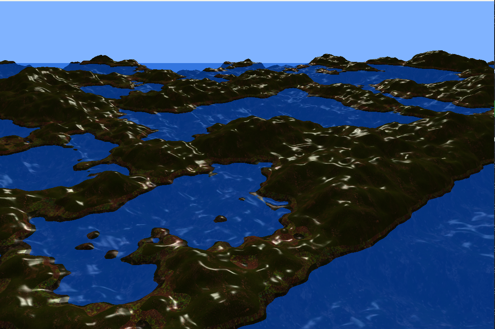

Proiectul acesta generează teren procedural folosind OpenGL și Perlin Noise.  

## Screenshot

## Tehnologii folosite
- C++17
- OpenGL
- GLSL (Vertex & Fragment Shaders)
- stb_image pentru încărcarea texturilor
- tinyobjloader pentru modele 3D

## Structura proiectului
- `Proiect_PG2/` – cod sursă
- `Assets/` – texturi și resurse
- `x64/` – build local

## Cum compilezi
1. Deschide `Proiect_PG2.sln` în Visual Studio
2. Setează configuratia `Debug` sau `Release`
3. Compilează și rulează proiectul
